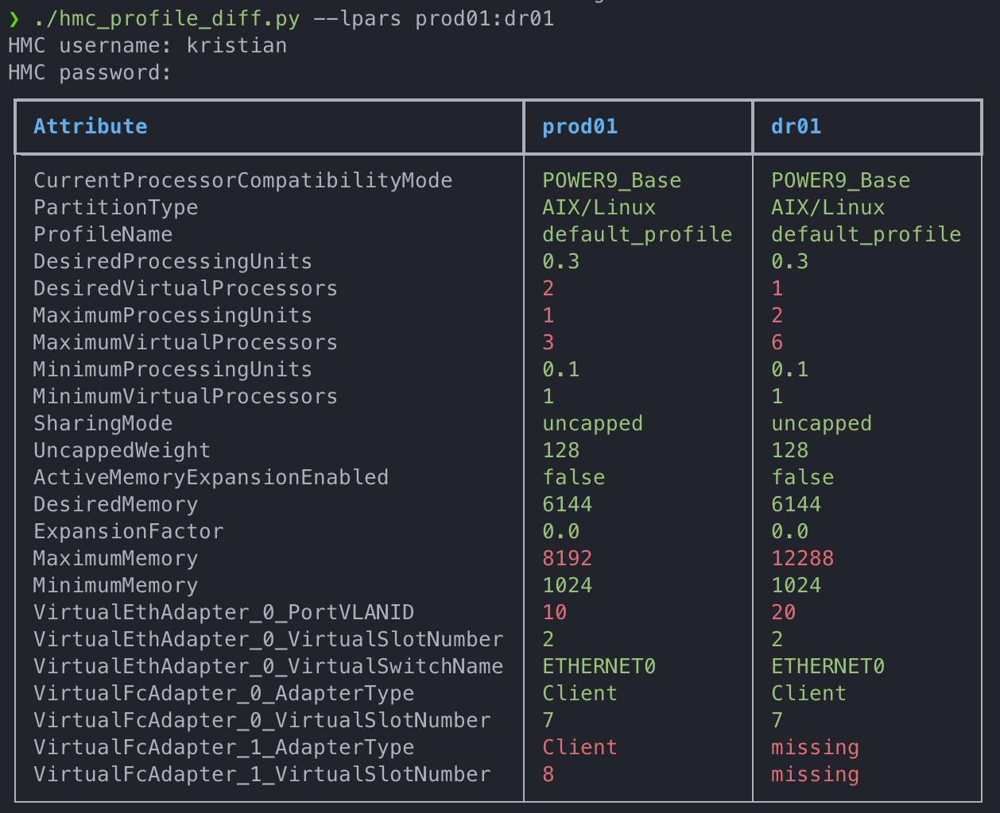
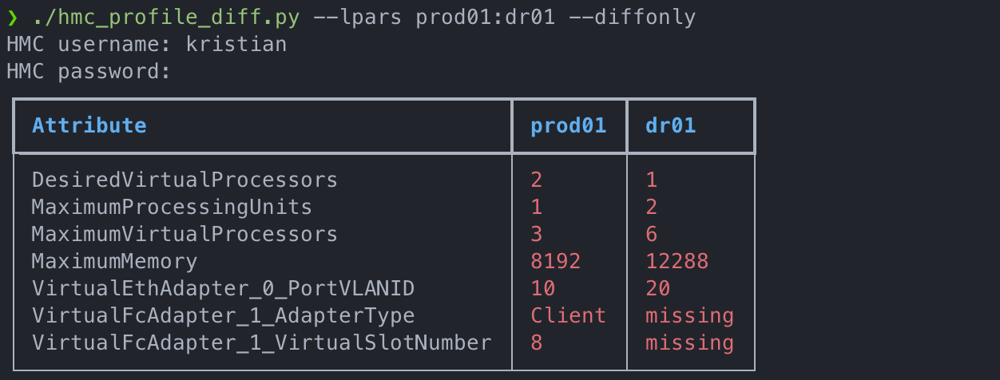

# HMC LPAR profile diff

This script can be used to compare two HMC LPAR profiles for differences in configuration.


## Table of contents

* [Usage](#usage)
  * [Compare and show all LPAR attributes](#compare-and-show-all-lpar-attributes)
  * [Compare and show only different LPAR attributes](#compare-and-show-only-different-lpar-attributes)
* [Requirements](#requirements)
  * [Python](#python)
  * [Hardware Management Conle (HMC)](#hardware-management-conle-hmc)
* [Configuration](#configuration)
* [Contributing](#contributing)
* [License](#license)
* [Contact](#contact)
* [Acknowledgments](#acknowledgments)

## Usage

```text
❯ ./hmc_profile_diff.py
usage: hmc_profile_diff.py [-h] (--lpars [LPARS ...] | --file FILE) [--hmcs HMCS] [--diffonly]

Compares the HMC profiles of two LPAR's and highlights any differences.


optional arguments:
  -h, --help           show this help message and exit
  --lpars [LPARS ...]  pair(s) of LPAR's to compare separated by a space. LPAR names are case sensitive. (e.g. --lpars prod01:dr01 prod02:dr02)
  --file FILE          file location of LPAR's to compare
  --hmcs HMCS          override HMC's listed in configuration file
  --diffonly           only show the differences between LPAR's

Format for the input file when using --file:
    prod01:dr01
    prod02:dr02

Output colours:
    green : Values match
      red : Values don't match or value missing
```

The following LPAR profile attributes are compared.

| General                           | Processor                | Memory                       | Virtual Ethernet Adapter | Virtual FC Adapter | Virtual SCSI Adapter |
| --------------------------------- | ------------------------ | ---------------------------- | ------------------------ | ------------------ | -------------------- |
| CurrentProcessorCompatibilityMode | DesiredProcessingUnits   | ActiveMemoryExpansionEnabled | PortVLANID               | AdapterType        | AdapterType          |
| PartitionType                     | DesiredVirtualProcessors | DesiredMemory                | VirtualSlotNumber        | VirtualSlotNumber  | VirtualSlotNumber    |
| ProfileName                       | MaximumProcessingUnits   | ExpansionFactor              | VirtualSwitchName        |                    |                      |
|                                   | MaximumVirtualProcessors | MaximumMemory                |                          |                    |                      |
|                                   | MinimumProcessingUnits   | MinimumMemory                |                          |                    |                      |
|                                   | MinimumVirtualProcessors |                              |                          |                    |                      |
|                                   | SharingMode              |                              |                          |                    |                      |
|                                   | UncappedWeight           |                              |                          |                    |                      |

### Compare and show all LPAR attributes

```shell
./hmc_profile_diff.py --lpars prod01:dr01
```



### Compare and show only different LPAR attributes

```shell
./hmc_profile_diff.py --lpars prod01:dr01 --diffonly
```



## Requirements

### Python

The script is written in Python 3, and relies on the following external packages.

* rich
* requests
* PyYAML

### Hardware Management Conle (HMC)

You need to be able to access the HMC REST web services that operate on port `12443`, and be able to authenticate to the HMC. I've tested this on both HMC V9 and V10, using an account with the `hmcviewer` task role.

## Configuration

The configuration file `config/config.yaml` controls the following during script execution.

| Variable             | Default | Description                                     |
| -------------------- | ------- | ----------------------------------------------- |
| `hmcs`               | unset   | The HMC's to get LPAR attribute data from.      |
| `compare_<resource>` | True    | Enable/Disable specific group attribute checks. |
| `ssl_verify`         | True    | Enable/Disable SSL verification on the HMC.     |
| `debug`              | False   | Enable/Disable debug output.                    |

## Contributing

First are foremost, I'm a novice (at best) with Python, I was learning it while I was putting this script together. There are likely better, more secure, and more concise ways of achieving what this script does. I very much welcome pull request for either code enhancements, or to add features. If anything, to help me learn.

## License

Distributed under the GPL-3.0 license. See `LICENSE.txt` for more information.

## Contact

Kristian Milos - [@Kristijan](https://twitter.com/kristijan)

## Acknowledgments

[Nigel Griffiths](https://www.ibm.com/support/pages/aixpert-blog-nigel-griffiths-mrnmon) has written a number of tools that use Python to interact with the HMC API's, and I used this very much as a starting point for this script. Some of his code has either been used and/or modified in parts of the script.
